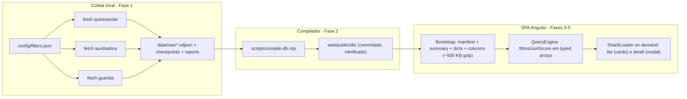

# Migração Angular + Database estático escalável

## Decisões fechadas

- Faixa do crawler: custo total mensal (aluguel + condomínio + IPTU + taxas) entre **R$ 1.500 e R$ 5.000**, sem limite de quantidade por fonte. 
- Coleta e compilação rodam **localmente**; o usuário commita manualmente os artefatos do database no repo. Sem crawl agendado em CI.
- **Hash routing** (`/#/explorar`) — zero configuração no GitHub Pages.
- Deploy: GitHub Action builda o Angular a cada push na `main` e publica no Pages.

## Arquitetura de dados

Dimensionamento medido no catálogo atual: 2,8 KB/listing completo (66% é `photoUrls`), 450 B/listing lite. Para ~27.000 listings: colunas ~450 KB gzip, lite total ~12 MB em ~210 shards de 55 KB, detail ~75 MB em ~420 shards de 180 KB. Filtro/sort client-side por varredura colunar: < 10 ms para 27k linhas — sem necessidade de índice invertido.

## Fase 1 — Crawler v2 (`scripts/`)

- [config/filters.json](config/filters.json): trocar `maxTotalCost: 4500` por `minTotalCost: 1500`, `maxTotalCost: 5000`, `maxListings: null`.
- QuintoAndar ([scripts/lib/quintoandar.mjs](scripts/lib/quintoandar.mjs)): passar min/max no filtro `TOTAL_COST` da API; manter filtro client-side como garantia. Auxiliadora e Guarida: filtro client-side de faixa (min+max) sobre `valorTotal`/`valores.total`.
- Saída em **NDJSON append-only** (`data/raw/{fonte}.ndjson`, 1 listing normalizado por linha) em vez de JSON em memória.
- **Checkpoint/resume** em `data/raw/.state/{fonte}.json` (página, IDs vistos, blocklist) — coleta interrompida retoma de onde parou; flag `--fresh` para recomeçar.
- Backoff exponencial em 429/5xx, jitter no rate limit (250–600 ms), limite de tentativas.
- Relatório `data/raw/report-{fonte}.json`: total reportado pela fonte vs. capturado, páginas, descartados por faixa, erros.
- Entrega da fase: **rodar a coleta completa real** e validar volumes contra as estimativas.

## Fase 2 — Compilador (`scripts/compile-db.mjs`)

Lê os NDJSON e emite `web/public/db/` (minificado, commitado):

- **Dedupe cross-fonte** conservador: bairro normalizado + área ±2 m² + quartos + aluguel ±5% (+ rua quando houver). Registro canônico ganha `alsoAt: [{source, url}]`; ambíguos vão para `data/raw/dedupe-review.json`.
- **Enriquecimento em build-time**: portar de [explorer.js](explorer.js) para `scripts/lib/enrich.mjs` os cálculos de tier, `centralityScore`, sinais sacada/sol, `featureScore`, `isApartment` — persistidos no DB. Só a aderência (depende das prioridades do usuário) permanece client-side, via bitmask.
- **Ordinais** sequenciais ordenados por `totalCost` asc (ordem default = shards contíguos na navegação típica) e **dicionários** (bairros, fontes, tipos, prefixos de URL de foto — corta ~50% dos bytes de foto).
- Artefatos: `manifest.json` (hash do build, contagens, mapa de shards), `summary.json` (agregados p/ KPIs e funil), `dicts.json`, `columns.json` (arrays por ordinal: custos, área, quartos, banheiros, vagas, neighbourhoodId, sourceId, typeId, tier, centralityScore, flags bitmask), `search.json` (string normalizada título+rua+bairro, lazy), `lite/shard-NNN.json` (128/shard), `detail/shard-NNN.json` (64/shard).
- **Validação** que falha o build: lengths de colunas iguais, ordinais contíguos, contagens batendo com manifest.
- `.gitattributes` marcando `web/public/db/`** como `linguist-generated -diff` para não poluir PRs.
- Scripts npm raiz: `crawl:{fonte}`, `crawl:all`, `db:compile`, `db:build` (crawl + compile).

## Fase 3 — Scaffold Angular + camada de dados (`web/`)

- Angular standalone (v19+, signals), `provideRouter(routes, withHashLocation())`, tema escuro do explorer como global (tokens CSS de [explorer.css](explorer.css)).
- `core/models/`: interfaces do manifest/colunas/lite/detail conforme schema do compilador.
- `core/data/`:
  - `DbClient` — fetch dos artefatos com `?v={buildHash}`; `manifest.json` com `cache: 'no-cache'`; Cache Storage API keyed pelo hash.
  - `ColumnStore` — hidrata `columns.json` em typed arrays.
  - `QueryEngine` — filtros (tier, bairros, fontes, tipo, quartos, mobiliado, pets, faixa de preço), aderência por bitmask + pesos, sort por qualquer coluna; retorna `Uint32Array` de ordinais. Puro e testável.
  - `ShardLoader` — lite/detail on-demand, coalescing de requests, LRU ~100 shards.
  - `ExplorerStateService` — signals de filtro/preset/sort/vista; `computed()` encadeando QueryEngine.
  - `PersistenceService` — localStorage (preset, prioridades, sort, vista, pins) e sessionStorage + query param `bairro` (seleção de bairros).
- **Testes unitários** do QueryEngine e do enrich (paridade com resultados do explorer.js atual) — é onde a mecânica de dados se prova.

## Fase 4 — Rota Explorer (paridade com explorer.js)

- Sidebar: presets (foco/ampliado/personalizado), tiers, multi-select de bairros com busca, prioridades soft, chips de imobiliária, sort.
- Funil, compass SVG (posições geradas pelo compilador a partir de tabela de coordenadas por bairro — resolve a limitação atual de 19 bairros fixos), scatter canvas (amostragem de ~2.000 pontos quando o recorte for maior) — tudo calculado só com colunas, funciona antes dos shards.
- Grid de cards com **virtual scroll/paginação incremental** (~24 por página, prefetch da próxima em idle), galeria (1 foto no lite; fotos completas no detail), vista cards/compacto.
- Modais de detalhe (carrega detail shard) e comparador (máx. 3 pins).

## Fase 5 — Rota Tabela (migração do index/app.js)

- KPIs do `summary.json`, filtros duros compartilhando o `QueryEngine`, gráfico de barras por bairro, tabela ordenável, busca textual carregando `search.json` sob demanda.
- Corrige de graça o bug atual do status que lê `meta.source` em vez de `meta.sources[]`.

## Fase 6 — Deploy e limpeza

- Workflow `.github/workflows/deploy.yml`: push na `main` → `ng build --base-href ./` em `web/` → `actions/deploy-pages`.
- README com o fluxo operacional: `npm run db:build` local → revisar reports → commit → push (deploy automático).
- Remover `index.html`, `explorer.html`, `app.js`, `explorer.js`, `styles.css`, `explorer.css`, `serve.mjs` e `data/*.json` legados após validar paridade no Pages.

## Riscos

- Volume real de 9.000+/fonte é hipótese — a fase 1 confirma antes de calibrar shards (parâmetros configuráveis no compilador).
- Anti-bot em coletas longas — mitigado por checkpoint/resume e backoff; fallback: coleta fatiada por faixa de preço.
- Dedupe heurístico — começa conservador com relatório de revisão manual.

